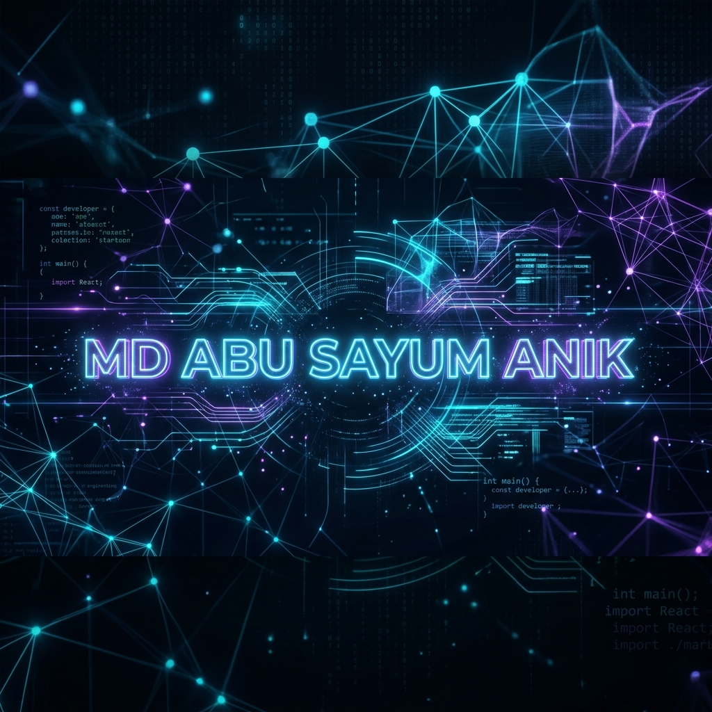

<div align="center">
  <a href="https://github.com/Anik-tB">
    
  </a>

  <br/><br/>

  <h1>⚡ MD ABU SAYUM ANIK ⚡</h1>
  <h3>Software Engineer • Full Stack & Mobile Architect</h3>

  <p>
    
  </p>

  <p>
    
  </p>
</div>

---

## 🛰️ SYSTEM DIAGNOSTIC & PROFILE
<div align="center">

| 🌌 CHARACTER VARIABLE | 🛰️ CORE ATTRIBUTES & SPECS |
| :--- | :--- |
| **CLASS** | Full-Stack & Mobile Developer |
| **LEVEL** | Senior CS Student (BSc @ UIU) |
| **BASE ATK** | Clean Architecture, OOP, Solid Principles |
| **SPECIAL PASSIVE** | *Showcase Champion* — Beyond The Galaxy winner |
| **CURRENT DIRECTIVE** | Scalable Microservices & Ultra-High-Fidelity Apps |
| **LOCATION** | Dhaka, Bangladesh |

</div>

<br/>

### 📊 OPERATIONAL STATUS (SKILL SPECIFICATION)
```text
System Architecture  [██████████] 100% (Clean code, OOP, Patterns)
UI/UX Engineering    [█████████░] 90%  (High-Fidelity UI, JavaFX, React)
Database & Scale     [████████░░] 80%  (MySQL, Node, System Design)
Competitive Logic    [████████░░] 80%  (Algorithm Design, Codeforces)
```

---

## 🛡️ TECH ARSENAL (REPOSITORIES & SKILLS)

### 💻 CORE LANGUAGES & PARADIGMS
<p align="left"><a href="https://skillicons.dev"></a></p>

### 🌐 FULL STACK & WEB ARCHITECTURE
<p align="left"><a href="https://skillicons.dev"></a></p>

### 📱 MOBILE, DESKTOP & DATA
<p align="left"><a href="https://skillicons.dev"></a></p>

---

## 🏆 MAJOR ACHIEVEMENTS
*   **🏆 Champion — Beyond The Galaxy (AOOP Showcase)**
    *   Defeated 50+ highly competitive teams with a high-fidelity desktop RPG system.
*   **🥈 1st Runner Up — Brainwave Microcontroller Project**
    *   Designed real-time hardware-software interface systems.
*   **🎓 UIU Merit Scholarships**
    *   Maintained consistent academic excellence and recognized performance.

---

## 🚀 FEATURED OPERATIONS (PROJECT SHOWCASE)

### 🌌 Beyond The Galaxy — `[ CHAMPION PROJECT ]`
> **JavaFX Desktop RPG Engine**
*   **Combative Mechanics**: Designed an asynchronous turn-based combat system with rich strategy execution.
*   **Marketplace Ecology**: Integrated an in-game economics system and item exchange mechanics.
*   **Architectural Mastery**: Implemented a robust architecture utilizing **MVC**, **Strategy**, and **Observer** design patterns.
*   **Visual Fidelity**: Built using customized premium styles and state-of-the-art layouts.

### 🛡️ Safe Space — `[ COMMUNITY SHIELD ]`
> **Emergency SOS & Reporting Grid**
*   **Real-time SOS Vector**: Instant emergency alerts routed to community nodes.
*   **Role-Based Grid**: Complete secure multi-tier authentication structure.
*   **Incident Engine**: Real-time analytical dashboard with active geographic reporting.

### 🏭 Industrial Safety & Workflow AI — `[ PREDICTIVE ANALYTICS ]`
> **AI/ML + Real-Time Telemetry Platform**
*   **Telemetry Integration**: Real-time processing of industrial sensor data streams.
*   **Safety Vectors**: Machine learning modules predicting workflow failures before occurrences.
*   **Operational Control**: High-frequency operational dashboards with live alert pipelines.

---

## 📈 SYSTEM TELEMETRY & ANALYTICS

<div align="center">
  <table border="0">
    <tr>
      <td>
        
      </td>
      <td>
        
      </td>
    </tr>
  </table>

  <br/>

  
</div>

---

## 🌐 CONNECT & ACCESS PROTOCOLS

<div align="center">

<a href="https://github.com/Anik-tB" target="_blank">
  
</a>
&nbsp;&nbsp;
<a href="https://linkedin.com/in/mdabusayumanik" target="_blank">
  
</a>
&nbsp;&nbsp;
<a href="mailto:mdabusayumanik123@gmail.com">
  
</a>
&nbsp;&nbsp;
<a href="https://codeforces.com/profile/aDistraction-null" target="_blank">
  
</a>

<br/><br/>

### `"Building resilient, scalable architectures that bridge code and real-world impact."`

</div>
