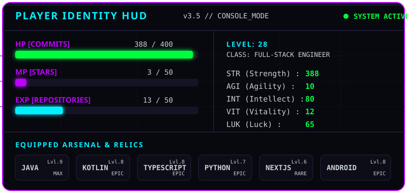
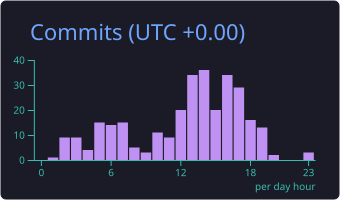
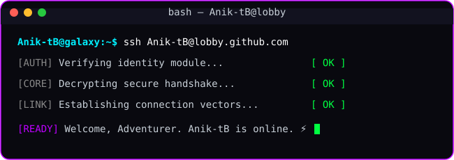

<!-- ══════════════════════════════════════════════════════════════════ -->
<!--              ANIK-tB ⟡ GITHUB PROFILE README v4.0                -->
<!--       Full-Stack & Mobile Architect · Systems & OOP Specialist    -->
<!-- ══════════════════════════════════════════════════════════════════ -->

<div align="center">

<!-- HERO BANNER -->
<a href="https://github.com/Anik-tB">
  
</a>

<br/><br/>

<!-- TECHNICAL IDENTITY HEADER -->
<h1>Md Abu Sayum Anik</h1>
<p>
  <strong>Software Architect ⟡ Full-Stack &amp; Mobile Engineer ⟡ System Design Specialist</strong>
</p>

<p>
  🏆 <strong>1st Place Champion</strong> · <em>Beyond The Galaxy AOOP Showcase (50+ Dev Teams)</em> &nbsp;|&nbsp; 
  🎓 <strong>UIU Academic Merit Scholar</strong> &nbsp;|&nbsp; 
  📍 <strong>Dhaka, Bangladesh</strong>
</p>

<!-- STATUS & METRIC PILLS -->
<a href="https://github.com/Anik-tB">
  
</a>
&nbsp;
<a href="https://github.com/Anik-tB?tab=followers">
  
</a>
&nbsp;

&nbsp;


</div>

<br/>

---

<!-- ══════════════════════════════════════════════════════════════════ -->
<!--                    SECTION I · TECHNICAL DOSSIER                  -->
<!-- ══════════════════════════════════════════════════════════════════ -->

<h2 align="center">🛰️ TECHNICAL DOSSIER &amp; ARCHITECT SPEC</h2>

<br/>

<div align="center">
<table border="0" cellspacing="0" cellpadding="0" width="100%">
<tr>
<td width="55%" valign="top">

```yaml
# ── SYSTEM IDENTITY ───────────────────────────────────
  Architect  :  Md Abu Sayum Anik
  Handle     :  @Anik-tB
  Discipline :  Full-Stack, Mobile & Distributed Systems
  Institution:  United International University (UIU)
  Degree     :  B.Sc. in Computer Science & Engineering
  Location   :  Dhaka, Bangladesh 🇧🇩 (UTC+6)

# ── CORE ARCHITECTURAL PARADIGMS ──────────────────────
  Design     :  GoF Patterns · MVC · Strategy · Observer
  Engineering:  Asynchronous Concurrency & Event Loops
  Clean Arch :  Modular Decoupling & High Cohesion
  UI / UX    :  High-Fidelity Gamified & Reactive Interfaces

# ── VERIFIED HONORS & RANK ────────────────────────────
  [ 🥇 CHAMPION ] Beyond The Galaxy AOOP Showcase (1st / 50+)
  [ 🥈 RUNNER-UP] Brainwave Microcontroller Hackathon
  [ 🎓 SCHOLAR  ] Consecutive Academic Merit Scholarship
```

</td>
<td width="45%" valign="middle" align="center">


<br/>


</td>
</tr>
</table>
</div>

<br/>

---

<!-- ══════════════════════════════════════════════════════════════════ -->
<!--                SECTION II · LIVE TELEMETRY CONSOLE               -->
<!-- ══════════════════════════════════════════════════════════════════ -->

<h2 align="center">📡 ENGINEERING TELEMETRY &amp; VELOCITY</h2>

<div align="center">

<!-- BESPOKE ARCHITECT HUD -->


<br/><br/>

<!-- DYNAMIC CONTRIBUTION SNAKE -->
<table width="100%" border="0" cellspacing="0" cellpadding="0">
<tr>
<td align="center">
  <strong>🐍 CONTRIBUTION VELOCITY (LIVE ACTIVITY MAP)</strong><br/><br/>
  <picture>
    <source media="(prefers-color-scheme: dark)" srcset="https://raw.githubusercontent.com/Anik-tB/Anik-tB/output/github-snake-dark.svg" />
    <source media="(prefers-color-scheme: light)" srcset="https://raw.githubusercontent.com/Anik-tB/Anik-tB/output/github-snake.svg" />
    
  </picture>
</td>
</tr>
</table>

<br/>

<!-- ROW: COMBAT STREAK & PRODUCTIVE TIME -->
<table border="0" cellspacing="0" cellpadding="4" width="100%">
<tr>
<td width="55%" align="center" valign="top">
  <strong>🔥 DEVELOPMENT STREAK METRICS</strong><br/><br/>
  
</td>
<td width="45%" align="center" valign="top">
  <strong>⏳ PRODUCTIVE VELOCITY CYCLE</strong><br/><br/>
  
</td>
</tr>
</table>

</div>

<br/>

---

<!-- ══════════════════════════════════════════════════════════════════ -->
<!--            SECTION III · FLAGSHIP ENGINEERING SYSTEMS            -->
<!-- ══════════════════════════════════════════════════════════════════ -->

<h2 align="center">🚀 FLAGSHIP ARCHITECTURAL SYSTEMS</h2>

<br/>

<!-- ── SYSTEM I: GENONEXUS ──────────────────────────────────────── -->
<table width="100%">
<tr>
<td width="18%" align="center" valign="middle">
  <br/><br/>
  
  <br/>
  <code>BIOINFORMATICS</code><br/>
  <code>CLINICAL AI</code>
</td>
<td valign="top">

### 🧬 GenoNexus — Enterprise Clinical Genomics &amp; Diagnostics Ecosystem
> *Comprehensive precision genomics infrastructure bridging clinical researchers, molecular diagnostic laboratories, and patient care.*

- 🌐 **Tri-Portal Architecture** — Role-governed portals with fine-grained access control: Clinical Research (`/dashboard`), Patient Health (`/user/dashboard`), and Public Gateway.
- ⚙️ **AI Genomic Pipeline** — High-performance Needleman-Wunsch viral-agnostic sequence alignment paired with a Random Forest mutation severity scoring engine.
- 💊 **Pharmacogenomics Engine** — Automated CPIC &amp; FDA guideline mapping to enzyme phenotypes (`CYP2D6`, `CYP2C19`) for risk-free precision drug prescribing.
- 📊 **Epidemic Forecasting Regressor** — Outbreak prediction engine ingesting global real-time epidemiological feeds with automated risk index estimation.
- 🎨 **WebGL 3D Chromosome Browser** — Client-side GPU-accelerated visualization mapping chromosome mutation loci and structural variations directly in the browser.

`Next.js` · `TypeScript` · `Python (NumPy / SciPy)` · `WebGL` · `PostgreSQL` · `TailwindCSS`

</td>
</tr>
</table>

<br/>

<!-- ── SYSTEM II: BEYOND THE GALAXY ─────────────────────────────── -->
<table width="100%">
<tr>
<td width="18%" align="center" valign="middle">
  <br/><br/>
  
  <br/>
  <code>GAME ENGINE</code><br/>
  <code>OOP ARCHITECTURE</code>
</td>
<td valign="top">

### 🌌 Beyond The Galaxy — Custom Asynchronous JavaFX RPG Engine
> *Award-winning desktop role-playing game engine engineered with advanced object-oriented design patterns, state machines, and asynchronous concurrency.*

- 🏆 **1st Place Champion** — Ranked **#1 out of 50+ competitive developer guilds** at the Beyond The Galaxy AOOP Showcase.
- ⚙️ **Asynchronous Battle Engine** — Deterministic turn-based combat system driven by a non-blocking multithreaded game state machine.
- 🏪 **Transactional Player Economy** — In-game marketplace with full transactional ACID-like inventory persistence and trade verification.
- 🧠 **Design Pattern Masterclass** — Seamlessly decoupled engine architecture orchestrating **MVC + Strategy + Observer + Abstract Factory + Command** patterns.
- 🎮 **Procedural World Generation** — Algorithmic dungeon generation, dynamic NPC dialogue trees, and modular talent progression trees.

`Java` · `JavaFX` · `Multithreading & Concurrency` · `Design Patterns` · `File I/O Persistence`

</td>
</tr>
</table>

<br/>

<!-- ── SYSTEM III: SAFE SPACE ───────────────────────────────────── -->
<table width="100%">
<tr>
<td width="18%" align="center" valign="middle">
  <br/><br/>
  
  <br/>
  <code>PUBLIC SAFETY</code><br/>
  <code>REAL-TIME GEO</code>
</td>
<td valign="top">

### 🛡️ Safe Space — Real-Time Community Crisis Response Network
> *High-reliability emergency SOS network and analytical incident dispatch system designed for rapid crisis coordination.*

- 🚨 **Instant Geo-SOS Beacon** — Low-latency distress signaling streaming real-time geolocation coordinates directly to emergency personnel.
- 🗺️ **Command &amp; Dispatch Heatmap** — Real-time geospatial incident clustering and analytical threat visualization for emergency operations.
- 📡 **Multi-Vector Alert Pipeline** — Resilient dual-path notification system featuring automated SMS failover alongside push-notification vectors.
- 🔐 **Zero-Trust Security &amp; Audit** — Multi-tier JWT authorization (Civilian / Responder / Admin) with encrypted incident logs and audit trails.

`Android (Kotlin)` · `Node.js` · `Firebase & WebSockets` · `Google Maps SDK` · `JWT` · `REST API`

</td>
</tr>
</table>

<br/>

---

<!-- ══════════════════════════════════════════════════════════════════ -->
<!--               SECTION IV · TECHNICAL ARSENAL                     -->
<!-- ══════════════════════════════════════════════════════════════════ -->

<h2 align="center">🎒 TECHNICAL ARSENAL &amp; SYSTEM STACK</h2>

<br/>

<div align="center">

<table border="0" cellspacing="0" cellpadding="8" width="100%">
<tr>
<th align="left" width="30%">DOMAIN</th>
<th align="left" width="45%">TECHNOLOGIES &amp; FRAMEWORKS</th>
<th align="center" width="25%">MASTERY LEVEL</th>
</tr>
<tr>
<td><strong>Core Systems &amp; Languages</strong></td>
<td><code>Java</code> · <code>Kotlin</code> · <code>TypeScript</code> · <code>Python</code> · <code>C++</code> · <code>PHP</code> · <code>SQL</code></td>
<td><code>★★★★★ ARCHITECT</code></td>
</tr>
<tr>
<td><strong>Mobile &amp; App Engineering</strong></td>
<td><code>Android SDK</code> · <code>Jetpack</code> · <code>Kotlin Coroutines</code> · <code>Android Studio</code></td>
<td><code>★★★★☆ ADVANCED</code></td>
</tr>
<tr>
<td><strong>Frontend &amp; Visualization</strong></td>
<td><code>Next.js</code> · <code>React</code> · <code>TailwindCSS</code> · <code>WebGL</code> · <code>JavaFX</code> · <code>HTML5/CSS3</code></td>
<td><code>★★★★☆ ADVANCED</code></td>
</tr>
<tr>
<td><strong>Backend &amp; Distributed Systems</strong></td>
<td><code>Node.js</code> · <code>Express</code> · <code>REST APIs</code> · <code>WebSockets</code> · <code>Multithreading</code></td>
<td><code>★★★★☆ ADVANCED</code></td>
</tr>
<tr>
<td><strong>Data Stores &amp; Caching</strong></td>
<td><code>PostgreSQL</code> · <code>MySQL</code> · <code>MongoDB</code> · <code>Redis</code> · <code>Firebase Firestore</code></td>
<td><code>★★★★☆ ADVANCED</code></td>
</tr>
<tr>
<td><strong>Infrastructure &amp; DevOps</strong></td>
<td><code>Git / GitHub Actions</code> · <code>Docker</code> · <code>Linux</code> · <code>Postman</code> · <code>Figma</code> · <code>VS Code / IDEA</code></td>
<td><code>★★★★☆ ADVANCED</code></td>
</tr>
</table>

<br/>

<!-- CLEAN ICON PILLS -->
<a href="https://skillicons.dev">
  
</a>

</div>

<br/>

---

<!-- ══════════════════════════════════════════════════════════════════ -->
<!--                SECTION V · HONORS & ACCREDITATIONS               -->
<!-- ══════════════════════════════════════════════════════════════════ -->

<h2 align="center">🏆 HONORS, AWARDS &amp; ACCREDITATIONS</h2>

<br/>

<div align="center">
<table border="0" cellspacing="0" cellpadding="8" width="100%">
<tr>
<td align="center" width="33%">

<br/>

**🥇 1ST PLACE CHAMPION**  
*Beyond The Galaxy AOOP Showcase*  
`JavaFX · Custom Game Engine · OOP Patterns`


</td>
<td align="center" width="33%">

<br/>

**🥈 1ST RUNNER UP**  
*Brainwave Microcontroller Hackathon*  
`Embedded Systems · Hardware Interfacing`


</td>
<td align="center" width="33%">

<br/>

**🎓 ACADEMIC MERIT SCHOLAR**  
*United International University*  
`Consecutive Academic & Engineering Excellence`


</td>
</tr>
</table>
</div>

<br/>

---

<!-- ══════════════════════════════════════════════════════════════════ -->
<!--                   SECTION VI · CONNECT & COLLABORATE             -->
<!-- ══════════════════════════════════════════════════════════════════ -->

<h2 align="center">🌐 CONNECT &amp; COLLABORATE</h2>

<div align="center">

<!-- TERMINAL LOBBY -->


<br/><br/>

<!-- SOCIAL & NETWORKING BADGES -->
<a href="https://github.com/Anik-tB" target="_blank">
  
</a>
&nbsp;
<a href="https://linkedin.com/in/mdabusayumanik" target="_blank">
  
</a>
&nbsp;
<a href="mailto:mdabusayumanik123@gmail.com">
  
</a>
&nbsp;
<a href="https://codeforces.com/profile/aDistraction-null" target="_blank">
  
</a>

<br/><br/>

<p align="center">
  <em>"Executing clean architectures, mastering logic at scale, and engineering resilient software systems."</em>
</p>

</div>
